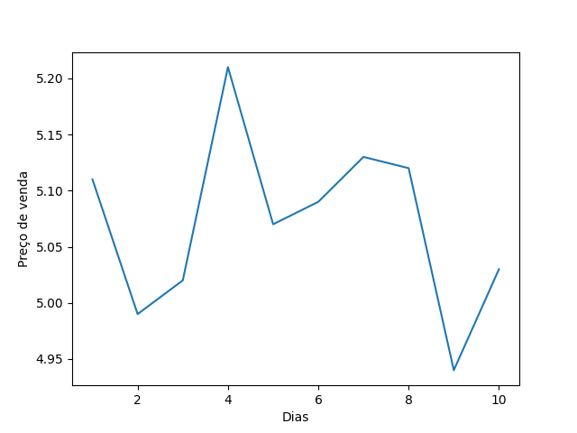

<h1>Analista de Dados EBAC</h1>

<h2>Controle de versão</h2>

<h3>Introdução</h3>

O intuito desta aula é 
ensiar ao aluno como trabalhar controle de versões usando
o git e o github.
Para auxiliar foi passado uma planilha que vidou um DataFrame.
Foi plotado um gráfico a partir dos dados informados no DF e gerado o arquivo gasolina.png: 

 
 
<h3>Bibliotecas utilizadas</h3>

Para manipulação dos dados e criação dos arquivos propostos
para o exercício foram usandos as seguintes Bibliotecas:
<strong>Pandas</strong> > Foi usado para transofrmar uma planilha simples em um DataFrame. 
<strong>Seaborn</strong> > Foi usado para criação do grafico a partir do DataFrame.

